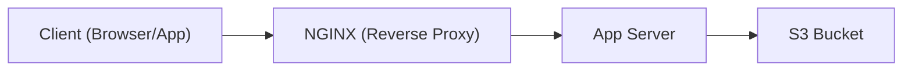
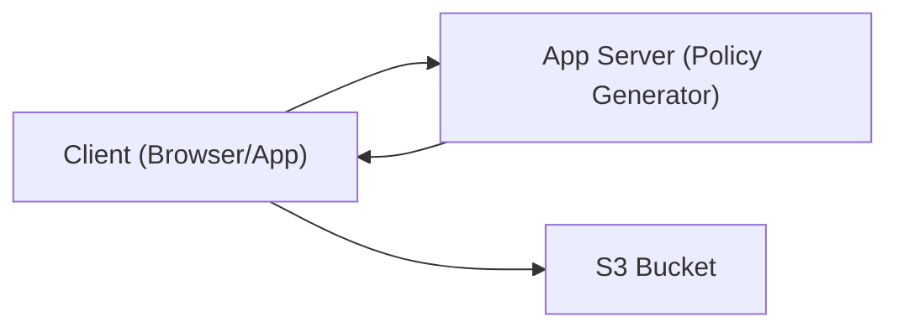

In many systems, file uploads follow a familiar pattern:

1. A client sends the file to your application server.
2. The backend processes it (e.g., for validation or virus scanning).
3. Then it forwards the file to a cloud storage service like Amazon S3.

While this works, it’s highly inefficient. Your app becomes a middleman consuming bandwidth, CPU, and memory, just to pass files along.

## Why This Is a Problem

This upload pattern:

- **Consumes resources** on your app server.
- **Increases latency** for users.
- **Stresses your infrastructure** (especially under load).
- **Breaks down for large files**, especially when you hit limits in intermediaries like API Gateway.

Let’s look at two common architectures where these problems show up.

## Two Upload Architectures Compared

### 🔸 Architecture 1: Upload with Nginx

This is typical in smaller-scale deployments with a single server behind a reverse proxy.



**Problems:**

- NGINX must **buffer** the file in memory or disk (an exception can be thrown here).
- App still receives and processes the full payload.
- Memory and CPU are wasted just to forward the upload.

### 🔸 Architecture 2: Upload via API Gateway + Load Balancer (No NGINX)

This setup is common in cloud-native apps using AWS infrastructure.


**Problems:**

- **API Gateway limits uploads to 10 MB** max per request.
- Both ALB and your app must handle the file payload.
- This creates bottlenecks and risks timeouts.

## ✅ The Solution: Presigned POST to S3

Instead of routing uploads through your backend, you can **let clients upload directly to S3**, securely, using a **presigned POST policy**.

### How It Works

1. The client asks your backend for a signed upload policy.
2. Your backend returns a temporary URL and form fields.
3. The client uploads the file directly to S3 using `multipart/form-data`.



## Benefits of Presigned Uploads

- 🚀 **Bypass Infrastructure**: No more file handling by NGINX, ALB, or API Gateway.
- 📉 **Reduce Server Load**: No memory or CPU usage from streaming file data.
- ⏱️ **Improve Latency**: Fewer hops and no buffering.
- 💡 **Avoid Limits**: Works around API Gateway’s 10MB payload cap.
- 🔐 **Secure**: You control what, where, and for how long uploads are allowed.

## Example Client Implementation (JavaScript)

Here’s how a client might perform the upload:

```js
async function uploadFile(file) {
  // Step 1: Get the presigned policy
  const res = await fetch('/api/get-presigned-policy?filename=' + file.name);
  const { url, fields } = await res.json();

  // Step 2: Prepare the upload
  const formData = new FormData();
  Object.entries(fields).forEach(([key, val]) => formData.append(key, val));
  formData.append('file', file); // must be last

  // Step 3: Upload to S3
  const uploadRes = await fetch(url, {
    method: 'POST',
    body: formData
  });

  if (uploadRes.status === 204) {
    console.log('Upload successful');
  } else {
    console.error('Upload failed');
  }
}
```

## When Should You Use Presigned POST?

- When handling **large file uploads**.
- When deploying behind **API Gateway**.
- When you want to **scale uploads** without scaling your backend.
- When you want **better performance** and **lower infrastructure costs**.

## Summary

If you're still uploading files through your backend, you're likely wasting resources, risking timeouts, and introducing unnecessary complexity.

Presigned POST policies in AWS S3 offer a better approach:

- Simple to implement.
- Secure and time-limited.
- Scalable and resilient.

Offload uploads to where they belong — your storage layer — and keep your app fast, lean, and maintainable.
